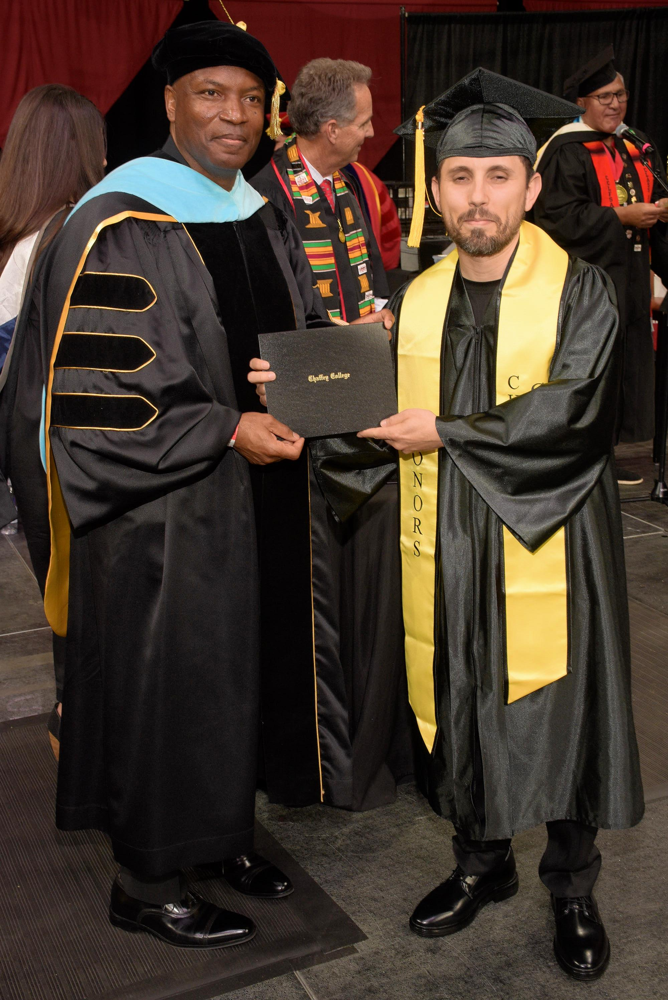

<!--
**Yoelbis/Yoelbis** is a ✨ _special_ ✨ repository because its `README.md` (this file) appears on your GitHub profile.

Here are some ideas to get you started:

- 🔭 I’m currently working on ...
- 🌱 I’m currently learning ...
- 👯 I’m looking to collaborate on ...
- 🤔 I’m looking for help with ...
- 💬 Ask me about ...
- 📫 How to reach me: ...
- 😄 Pronouns: ...
- ⚡ Fun fact: ...

-->

# Hi there, I'm Yoelbis! 👋

  

## About Me 🚀

I'm a passionate recently college-graduated **Web Developer**, with excellent coding skills. My unwavering commitment to quality and delivering measurable results is a core differentiator in my web development projects.

- 🌱 Currently learning: **React**.
- 🔭 Working on: **My colleage Kristie's portfolio and online store promotion (https://kristie-mei-ozima.com).**
- 🌍 Languages: **English and Spanish!**

## My Skills 🧠

 

<!--
*Replace the above skill badges with your own skills and expertise. To create more badges, use [checkout this repo](https://github.com/alexandresanlim/Badges4-README.md-Profile).*

## Featured Projects 💻

### [Project 1 Title](project_1_link)

**[Project 1 Title]** is a **[brief project description]** built with **[technologies used]**. This project demonstrates my ability to **[skills demonstrated by the project]**. You can check out the repository [here](project_1_repository_link).

### [Project 2 Title](project_2_link)

**[Project 2 Title]** is a **[brief project description]** built with **[technologies used]**. This project showcases my skills in **[skills demonstrated by the project]**. You can check out the repository [here](project_2_repository_link).
-->
## Get in Touch 📬

<!-- - **[Personal Website / Blog]**(your_website_or_blog_link)-->
- [My LinkedIn.](https://www.linkedin.com/in/yoelbis-galvez/)
- [My email.](mailto:yoelbiswork@gmail.com)

  

  

        
      

      

        
      

      

        

  
  
  

